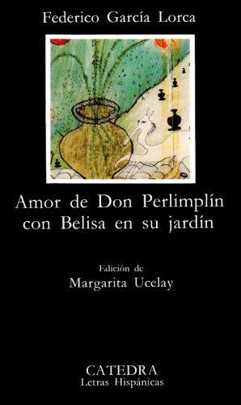
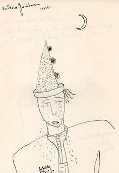
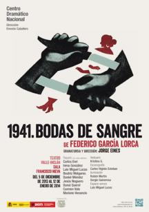
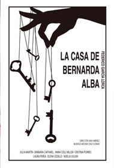

# El teatro de Lorca

## Farsas.

Aunque Lorca nunca pretendió ser dramaturgo, en 1924 comienza a escribir una obra que le obsesión durante toda su vida. . La primera noticia de esta obra la tenemos en el epistolario de Lorca, obra que terminará siendo _Amor de don Perlimplín con Belisa en su jardín_. La obra se encalla, se paraliza y hasta el año 1929 no tenemos una primera versión acabada. Es una farsa, una farsa trágica. Por esto Lorca es un genio, porque no imita, crea. Es una obra tradicional cuyo fondo genérico es transformado hasta convertirlo encC una gran tragedia.

+	*Amor de don Perlimplín con Belisa en su jardín*: se conserva la versión para su estreno de 1933. Se trata de una farsa clásica dividida en cuatro cuadros. El subtítulo es "Aleluya erótica en cuatro cuadros". Reelabora el viejo tema del hombre anciano casado con la joven. El título es ridículo que rima en pareado. Procede de un género subliterario que Lorca había conocido desde niño y con el que se había formado literariamente: las aleluyas (historias narradas que avanzan en celdillas en cada una de las cuales aparece un dibujo que ilustra los dos versos que en la parte inferior de la ilustración explican lo que sucede en las mismas. Son de género histórico pero las que Lorca conoce están dirigidas a un público infantil. Estos dos versos siempre riman en pareado. Esta es la razón por la que Lorca rima en pareado.) Tanto es así que Perlimplín y Marcolfa no son personajes inventados sino que son extraídos de dos personajes que aparece en las aleluyas que conoce de niño. Hasta aquí parece que Lorca no ha inventado nada. Así engaña al espectador en el primero y en casi todo el segundo cuadro. Todo espectador y lector teatrales tienen unas expectativas. {width="70%"} El espectador espera que el viejo sea engañado por la joven pero desde una perspectiva cómica. Esto se mantiene con matices en el primer cuadro frente a la convención realista de los entremeses pero Lorca pervierte esta convención realista del entremés. Perlimplín aparece ataviado casi como un payaso (viste de verde y con una enorme peluca blanca). El verde informa al espectador desde el momento de la aparición del destino del personaje que morirá en escena ya que el verde para Lorca simboliza muerte. Es un hombre de más de cincuenta años, como el Quijote, que dice no haber tenido contacto con ninguna mujer y haber pasado su vida entre libros. También es ridículo por su manera de hablar, propia del teatro infantil, como si fueran niños hablando. En esta primera configuración del personaje como un personaje ridículo se produce la aparición del personaje femenino no sexual, sino eróticamente a través de unas cortinas. Esto supone una dificultad escénica porque el espectador tiene que ver a Belisa. Esta canta una canción popular erotizada. Ante este canto Perlimplín responde y Marcolfa intenta que establezca matrimonio con una especie de chantaje emocional (ella es vieja y se va a morir por lo tanto Belisa va a quedar sola). Al final del primer cuadro una bandada de pájaros negros cruza la escena como símbolo de mal agüero. Y una reacción de Perlimplín, un pequeño matiz con el que se rompa el convencionalismo, ha tenido una primera erección al ver a Belisa y este se asusta, vive la erección con temor. Con esta reacción Lorca nos está diciendo que Perlimplín es un niño en asuntos eróticos. Esto enlaza con el segundo cuadro en la habitación de Perlimplín con seis balcones. No es una habitación realista. En medio de la misma hay una enorme cama con dosel y penachos de plumas. Tampoco es una cama realista. Se parece a un coche fúnebre pero lo más importante, es la muerte simbólica de una faceta de este personaje. La enormidad de la habitación y de la cama tiene que ver con la proyección de la vista de un niño porque en el aspecto sexual es un niño. Es un espacio simbólico surrealista. Tiene seis ventanas porque el deseo de Belisa se le escapa, él no tiene capacidad para contener ese deseo. Al espectador le llega la información de que Perlimplín ha sido engañado en su primera noche de bodas por 5 hombres representantes de las cinco razas distintas. Es una situación completamente inverosímil porque en realidad es una proyección de los temores de Perlimplín. El espectador se congracia con el destino pero en el momento final aparecen dos duendes, uno por cada lado del escenario, y cierran el telón que dicen al espectador que no van a ver lo que esperaban. Los duendes pueden decir lo que quieran al espectador porque no pertenecen a nuestra realidad, son seres completamente ficcionales. Estos rompen la cuarta pared y preguntan al espectador. El público pretende verse representado en las tablas. Lorca va  a impedir que el público se ría de su personaje. Cuando los duendes desaparecen, aparece Perlimplín ataviado con un casco con unos enormes cuernos, lo que confirma que ha sido engañado sexualmente. La pulsión fácil del espectador es  reírse pero Lorca evita esta reacción en él. Perlimplín habla en verso, se transforma en un héroe clásico, y para las intenciones de reírse al espectador. Se convierte en un personaje completamente trágico que canta el dolor del amor "Decid que ha sido el ruiseñor, bisturí de cuatro filos". Es un personaje distinto, herido de amor. A partir de este momento, la obra es un incremento trágico. Tercer cuadro, comedor del matrimonio: convencionalismo puro. El espacio es el triunfo de la convención, de la comedia burguesa, de la reconstrucción de la unidad matrimonial. Pero este espacio está connotado: los muebles están pintados de verde y negro, los dos colores mortuorios de Lorca, y además están desordenados. No es nada verosímil porque es contrario a lo que el espectador imagina. Perlimplín no solo perdona a su mujer que le haya engañado sino que insta a que le engañe, en particular con el hombre de la capa roja, que es él mismo. Perlimplín inventa su contrario, un don Juan, frente el carácter diurno de Perlimplín, el carácter nocturno del hombre de la capa roja. Este último es joven, conquistador, escribe cartas que conquistan a Belisa. Perlimplín busca sentirse amado por una vez en su vida. El cuarto cuadro es el más bello. Se desarrolla en el jardín, e un jardín de naranjos y cipreses (vida y muerte). En este espacio se produce el encuentro entre Belisa y quien ella crees que es su amante y entonces Perlimplín descubre su verdadera identidad. Belisa queda desconcertada y este se suicida con un puñal de diamantes y esmeraldas. Aparece la virgen dolorosa que es Marcolfa que recoge el cuerpo de Perlimplín muerto pero Belisa sigue preguntando por el hombre de la capa roja. Entendemos que Perlimplín simbólicamente es Cristo y entendemos que la reacción de Belisa es no entender el sacrificio de su marido. Tampoco el hombre entendió el sacrificio de Cristo. Perlimplín le ha otorgado la salvación en el amor a Belisa. 

La otra gran farsa de Federico es _La zapatera prodigiosa_, una obra mucho más tardía estrenada en 1931. Se apoya en el mismo tema: la malcasada o el marido cornudo. Tenemos un drama enormemente moderno porque parece que el espectador sabe aquello que va a ver. El espectador espera el engaño de la mujer. Sin embargo, el engaño no se produce, pues Lorca juega con las apariencias y engaña al espectador. Desarrolla a través de un entremés cervantino con motivos vanguardistas. 

El escritor granadino trata de ganarse al público y cambia su manera de hacer teatro a partir de su viaje a Nueva York.

## Teatro surrealista.

+	*El público*. Esta obra plantea el gran problema del teatro de Lorca: qué público quiere y qué público necesita para que se entienda su teatro lo mejor posible. Lorca organiza una ficción incomprensible que se basa en una sucesión de cuadros que proyectan sus preocupaciones, pulsiones y sueños, visiones oníricas, con una capacidad de intelección por parte del espectador mínica (no tiene referencialidad directa). Se titula así porque el autor, a través de unos ensayos teatrales dirigidos por un director (Enrique) homosexual pero incapaz de decir que lo es y una serie de actores que pasan por delante de él, en particular uno (Gonzalo) que se enfrenta a él y le dice que hasta que él no se deje de mentir a sí mismo no logrará alcanzar lo que persigue. Mediante estos cuadros Lorca plantea dos tipos de teatro: lo que se llama en la obra el teatro al "aire libre" que es el teatro de la mentira, el teatro burgués, que es el teatro que es el que está ensayando Enrique ("Romeo y Julieta" amor estereotipado, la obra más convencional escrita por Shakespeare). El director está ensayando una obra convencional y Gonzalo se enfrenta a él y dice que tienen que hacer "teatro bajo la arena", un teatro en el que se rompan las convenciones y que el público no se sorprenda por esa ruptura. Todo esto con una serie de imágenes oníricas en ocasiones muy difíciles de ver y muy difíciles de llevar a escena. Los demás personajes son proyecciones de los primeros, que a su vez representan una frustración erótica. 

+	*Así que pasen cinco años* es la otra obra teatral surrealista de Lorca que se gesta en Nueva York y terminada en 1931. En esta se cuenta el conflicto sexual de su protagonista, El Joven. Un personaje que es incapaz de enfrentar su sexualidad y dilata en el tiempo la culminación de esa sexualidad. La parapeta detrás de un deseo heterosexual. Hay una mujer a la que no quiere llamar novia porque tiene una implicación sexual. Otra segunda mujer, Mecanógrafa, cuyo intento sexual también se dilata. La novia acaba lanzándose en los brazos de un jugador de rugby (representante de la hombría). La mecanógrafa acaba por acceder a un matrimo que acabará trágicamente. El joven acaba muriendo como San Sebastián, asaeteado por una flecha en el corazón como símbolo de una justicia poética por mentir en el amor. No sabemos si la muerte se produce realmente porque estamos ante una proyección onírica. 

Después de estas dos obras surrealistas, Lorca comienza a escribir dramas rurales. Es en esta subdivisión del teatro lorquiano es en la que se incluye la trilogía por la que más éxito obtuvo: *Bodas de sangre*, *Yerma* y *La casa de Bernarda Alba*.

+	*Bodas de sangre* (1933) la historia de un matrimonio pactado entre el novio y la novia. Ningún personaje tiene nombre menos Leonardo, el amante. Los demás son denominados de manera cosificadora por la función que cumplen en la obra y no por lo que son. Es la misma historia que Lorca {width=20%} cuenta siempre. Lo aleatoriamente injusto del amor. De tal manera que marca el destino trágico. La novia está tremendamente enamorada de Leonardo pero este es un cobarde y se casa con la prima de la novia. Esta se ve obligada a pactar una boda con alguien que no le gusta pero que es bueno. El día de la boda, Leonardo rapta a la novia para consumar el destino. Se la lleva al monte y allí aparecen dos figuras: la luna blanca, a veces representada en forma de mujer, la luna custodia a los amantes y simboliza la culminación sexual. El amante y el novio se matan el uno al otro, y la novia debería haber huído porque se trata de una mujer defenestrada pero en lugar de eso vuelve al pueblo. Esto quiere decir que vuelve a la normativa, a lo apolíneo. Visita a la madre del novio y le pide perdón y niega haber mantenido relaciones con Leonardo para recuperar la norma frente al espectador. 

+	*Yerma* (1934) frustración del amor porque esta esta profundamente enamorada de un hombre, Víctor (vencedor), un pastor que cruza sus ventanas cada mañana. Hombre con quien podría haberse casado y haberla hecho madre. Sin embargo, ella esta casada con Juan (nombre connotado, podría ser cualquiera, un don nadie) que después de varios años de matrimonio no tiene hijos y ella observa como las mujeres de su quinta tienen ya un hijo y esperan un segundo mientras se dedica a bordar pañales para otras madres. (Bordar tiene sentido sexual porque recrea el acto. Lo mismo hacen las hijas de Bernarda). Ella descubre que la esterilidad viene de la estirpe de su marido. Se encuentra con una especie de bruja que ve más allá le dice que la culpa no es suya y le insta a que escape con su hijo. Yerma se niega a marcharse. Se autoimpone la norma. En una romería (una tradición religiosa y profana) se vuelve a encontrar con la bruja que la persuade pero no la convence. Se encuentra con Juan al final de la romería que quiere poseerla pero como ya sabe con certeza que no va a quedarse embarazada le da asco y lo mata. Se condena por tanto a su esterilidad para no engañarlo. 

+	*La casa de Bernarda Alba* (1936) es una tragedia desnuda, esto es, la acción, el espacio, el tiempo quedan reducidas al mínimo. Es una tragedia desnuda que se basa en un bicromatismo que es el contraste continuo del blanco y el negro. El blanco de las sábanas que bordan las hermanas, el blanco de las enaguas que no volverá a otcar un hombre, el blanco de las paredes, el blanco del vestido de Maria Josefa que es la única persona que dislumbra la tragedia; el negro de los hábitos (Bernarda, las hijas, Poncia), el negro del agua empozada. Solo existe una mancha de color, el vestido verde de Adela que anuncia el destino del personaje. Es una tragedia de nombres parlantes: Bernarda Alba (renacer, amanecer, no hay nadie más oscuro que Bernarda; el nombre es la que tiene fuerza de oso);  Poncia, porque se lava las manos y deja que suceda la tragedia; Adela; Martirio, una mujer acomplejada; Amelia, amable, es un personaje que intenta evitar el conflicto; Magdalena, su carácter lastimero y lloroso, la única hija que llora la muerte de su padre (Poncia dice "La única que le quería"), le quería en un sentido incestuoso?,  Lorca no resuelve este problema porque no le interesa. Adela y Martirio mantienen el conflicto pero tienen una relación amor-odio;  Angustias, el nombre marca la existencia de la mujer de 39 años requerida por Pepe el Romano por motivos económicos. El espacio exterior de la casa está latente en toda la obra y es custodiado por Pepe el Romano. Esto quiere decir que la casa de las mujeres está rodeada de deseo que quiere penetrar en ella. Es un personaje al que no vemos pero siempre está presente. Lorca transmite esta tensión al espectador. Es una tragedia de carácter dionisiaco porque Adela busca la libertad. Esta libertad hace que se imponga a toda fuerza para conseguir su deseo erótico, deseo erótico que logra una noche tras otra con Pepe el Romano. Este deseo se rompe por la mentira. Solo hay una fuerza superior al deseo que es la libertad individual, por esto Adela se impone con su decisión de suicidarse. Esto contrasta con la mentira de Bernarda al final de la obra cuando dice "Mi hija ha muerto virgen. Vestidla de blanco. A callar. Silencio." porque no hay argumento verbal para combatir esta mentira.