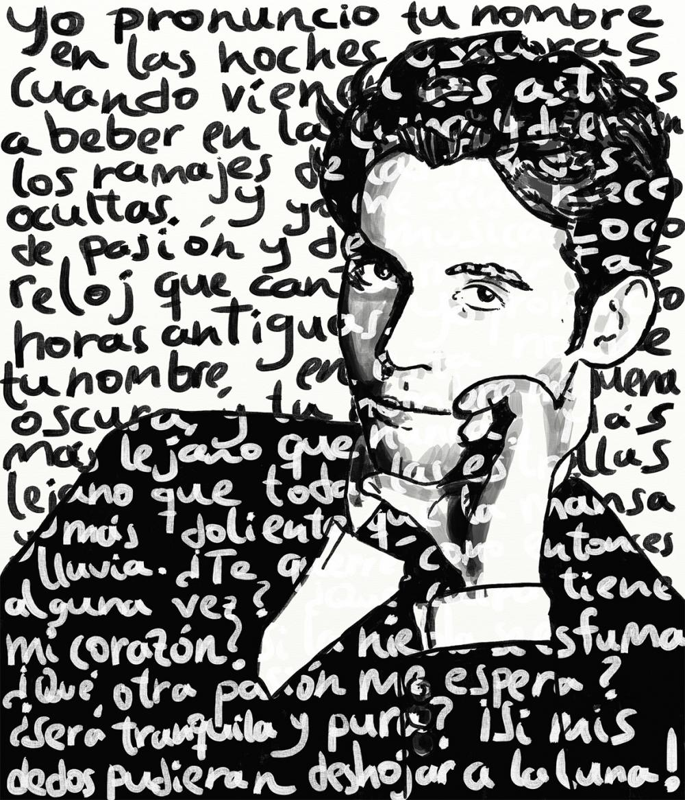

## La poesía de Federico García Lorca

{width=70%}\centering

## Índice

1. Datos biográficos relevantes
2. Primera etapa. Etapa de juventud
3. Segunda etapa. Etapa neopopularista
	+ *Romancero gitano*
4. Tercera etapa. Etapa surrealista o de madurez
	+ *Poeta en Nueva York*
5. Cronología de las obras

## Datos biográficos relevantes:

1928 Publicación del *Romancero gitano*

### Consecuencias.

+ Críticas negativas de Dalí 
+ Depresión en el poeta
+ Viaje a Nueva York. Rompe con su poesía anterior.

## Primera etapa. Estapa de juventud

### Características

+ Influencia modernista.
+ No tiene voz propia.
+ Se intuye un futuro acercamiento a las vanguardias.

## Primera etapa. Estapa de juventud

Poemarios

+ *Impresiones y paisajes* (1918)
+ *Libro de poemas* (1923)
+ *Suites* (conocido a partir de 1923)

## Segunda etapa. Etapa neopopularista

### Características.

+ Acercamiento al flamenco.
+ Temas: muerte, destino inexorable, presentimiento...
+ Influencia barroca (Lope de Vega)

## Segunda Etapa. Etapa neopopularista.

Poemarios.

+ *Poemas del cante jondo* (1921)
+ *Canciones* (1927)
+ *Romancero gitano* (1928)

## Segunda etapa. Etapa neopopularista

### *Romancero gitano*

+ 18 romances
+ Temas: la muerte, la noche, la luna.
+ Ambientado en Andalucí y dedicado al pueblo gitano.
+ Tratamiento metafórico y mitificado de este pueblo. 

## Tercera etapa. Etapa surrealista o de madurez.

### Características

+ Imágenes surrealistas y oníricas con base en hechos concretos
+ Eliminación del control lógico
+ Ansia de comunicación mediante otras vías
+ Falsas apariencias que ocultan la verdadera realidad

## Tercera etapa. Etapa surrealista o de madurez.

Poemarios:

+ *Llanto por Ignacio Sánchez Mejías* (1935)
+ *Seis poemas galegos* (1935)
+ *Poeta en Nueva York* (1940)
+ *El diván de Tamarit* (1940)
+ *Sonetos del amor oscuro* (1983)

## Tercera etapa. Etapa surrealista o de madurez.

### *Poeta en Nueva York*

+ Consta de diez partes.
+ El poeta crea múltiples "yo"
	+ Pierrot
	+ San Sebastián 
	+ Cristo
+ Parece un diario poético. 
* Publicado póstumamente en 1940

## Cronología de obras

### Obras y fecha de publicación 

Obras | Año de publicación
-- | --
Impresiones y paisajes | 1918
Libro de poemas | 1921
Suites | 1923
Poema del cante jondo | 1921
Canciones | 1927
Romancero gitano | 1928
Llanto por Ignacio Sánchez Mejías | 1935
Seis poemas galegos | 1935
Poeta en Nueva York | 1940
Diván de Tamarit | 1940
Sonetos del amor oscuro | 1983

## Conclusiones

### Poética lorquiana extraida de sus conferencias:

+ Importancia absoluta de lo popular y lo tradicional
	+ Lírica medieval y romancero
+ Necesidad de asociar la poesía a la música
+ Necesidad de una vanguardia que una lo culto con lo popular
+ La poesía como el mejor modo de expresar:
	+ Lo erótico
	+ Lo telúrico
	+ Lo pulsional

## Más información

+ [Elevación de lo popular en la poesía de Lorca](http://www.cervantesvirtual.com/obra/elevacion-de-lo-popular-en-la-poesia-de-lorca/)
+ [Introducción a la lectura poética de Federico García Lorca](http://cvc.cervantes.es/ensenanza/biblioteca_ele/aepe/pdf/boletin_13_07_75/boletin_13_07_75_09.pdf)

