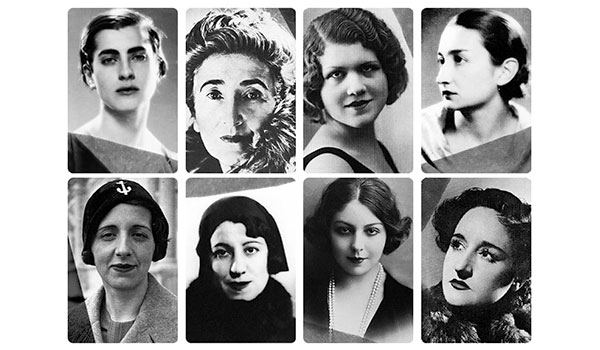
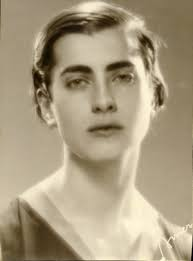
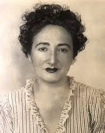
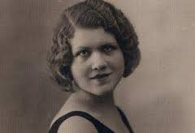
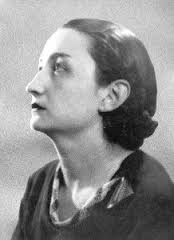
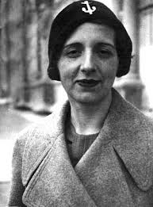
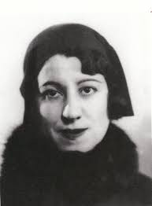
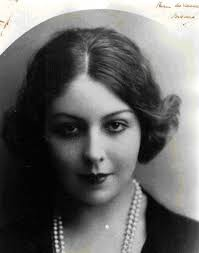

## Las mujeres del 27

{width=70%}\centering

## Índice

1. Marga Gil Roësset
2. Rosa Chacel
3. Josefina de la Torre
4. Ernestina de Champourcín
5. María Zambrano
6. Concha Méndez
7. María Teresa León
8. Maruja Mallo

## Marga Gil Roësset

{width=40%}\centering

(1908-1932)

## Marga Gil Roësset

### Biografía.

+ Nace en 1908 en Las Rozas.
+ Talento para el dibujo y la escritura desde edad temprana.
+ 1920 y 1923 ilustra cuentos publicados por su hermana.
+ Comienza a dedicarse a la escultura.
+ 1930 inaugura su exposición *Adán y Eva*.
+ Se suicida en 1932.

## Marga Gil Roësset

Obra

### Características

+ Transición acelerada del modernismo a las vanguardias.
+ Escultura: talla de madera, vaciado de escayola.
+ Ilustración: acuarela y tinta china
	+ Combina modernismo y sibolismo.

## Obra

### Antes de suicidarse trató de destruir toda su obra. En 2001 el Círculo de Bellas Artes recuperó gran parte de ella. 

## Rosa Chacel

{width=35%}\centering

(1898-1994)

## Rosa Chacel

### Biografía

+ Nace en Valladolid en 1898.
+ Se trasladan a Madrid. Se matricula en el Colegio de Bellas Artes de San Fernando.
+ Entra en contacto con las vanguardias.
+ Muere en Madrid en 1994.

## Rosa Chacel.

### Características.

+ Escribe novela, poesía y cuento.
+ Gran introspección e intimismo.
+ Juzga el mundo exterior. 

## Josefina de la Torre

{width=50%}\centering

(1907-2002)

## Josefina de la Torre

### Biografía

+ Nace en Las Palmas de Gran Canaria en 1907.
+ Contacto con el mundo de las artes muy temprano.
+ 1924 va a Madrid y se relaciona con los escritores del 27.
+ Años 40 escribe guiones cinematográficos y actúa en películas.
+ Fallece en Madrid en 2002.

## Josefina de la Torre

Obra:

### Características:

+ Versatilidad genérica: teatro, cine, novelas, poesía.
+ Temas: infancia, muerte prematura, soledad.
+ Descripción del paisaje insular.
+ Estilo aparente sencillo. 

## Ernestina de Champourcín

{width=35%}\centering

(1905-1999)

## Ernestina de Champourcín

### Biografía

+ Nace en Vitoria en 1905.
+ 1910 se traslada a Madrid.
+ No puede ir a la universidad por la oposición de su padre.
+ Publica poemas y trabaja como traductora.
+ 1939 se exilia con su marido.
+ en 1972 regresa a Madrid donde muere en 1999.

## Ernestina de Champourcín

Obra: 

### Características:

+ Presencia de la mística y la religiosidad.
+ Tres etapas:
	+ Poesía del amor humano (hasta 1936)
	+ Poesía del amor divino (1936-1974)
	+ Poesía del amor sentido (1974-1991)

## María Zambrano

{width=40%}\centering

(1904-1991)

## María Zambrano

### Biografía

+ Nace en Málaga en 1904.
+ 1913 comienza bachillerato.
+ 1924 se matricula en Filosofía y Letras en Madrid.
+ Profesora auxiliar de Zubiri. Implicación social y política.
+ Se exilia en 1939: América, Europa.
+ 1984 regresa a Madrid y muere en 1991

## María Zambrano

Obra: 

### Pensamiento:

+ Convertir la razón en el instrumento adecuado para el conocimiento de la realidad.
	+ Orfismo y pitagorismo.
	+ Neoplatonismo.
	+ Esoterismo cristiano, sufismo.
+ Razonamiento y corazón.

## Concha Méndez

{width=40%}\centering

(1898-1986)

## Concha Méndez

### Biografía

+ Nace en Madrid en 1898.
+ 1919 conoce a Buñuel e inicia una relación. Se une al grupo del 27.
+ Se emancipa de la casa familiar y realiza numerosos viajes. 
+ 1932 se casa con Manuel Altolaguirre.
+ Se exilia, primero en París y luego La Habana y México.
+ Muere en México en 1986.

## Concha Méndez

Obra: 

### Características:

+ Primera etapa
	+ Influenciada por las vanguardias y el Alberti neopopularista.
+ A partir de los años 30:
	+ Voz más personal y depurada.
	+ Acercamiento a la voz del último Antonio Machado.

## María Teresa León

{width=40%}\centering

(1903-1988)

## María Teresa León

### Biografía:

+ Nace en Logroño en 1903.
+ Sobrina de Maria Goyri y Ramón Menéndez Pidal.
+ 1929 abandona a su primer marido y se casa con Rafael Alberti.
+ Producción poética y compromiso social. 
+ 1939 se exilia con Alberti. 
+ Muere en Madrid en 1988.

## María Teresa León

Obra: 

### Características:

+ Cultiva la prosa, el teatro y la poesía.
+ Una primera etapa influenciada por las vanguardias.
+ Segunda etapa de realismo socialista.

## Maruja Mallo

{width=40%}\centering

(1902-1995)

## Maruja Mallo

### Biografía

+ Nace en Lugo en 1902.
+ 1922 ingresa en la Real Academia de Bellas Artes de San Fernando en Madrid.
+ Se relaciona con artistas de la generación del 27.
+ 1932 viaja a París. 
+ 1939 se exilia. Colabora en la revista *Sur* de Argentina.
+ 1962 regresa a España y muere en Madrid en 1995.

## Maruja Mallo

Obra:

Es una de las pintoras surrealistas más importantes de preguerra.

### Características: 

+ Primera etapa:
	+ Academicista.
+ Segunda etapa:
	1932 viaja a París y comienza a cultivar el surrealismo.

## Las sinsombrero

Más información:

###

[Documental de RTVE sobre *Las sinsombrero*](http://www.rtve.es/alacarta/videos/imprescindibles/imprescindibles-sin-sombrero/3318136/)

